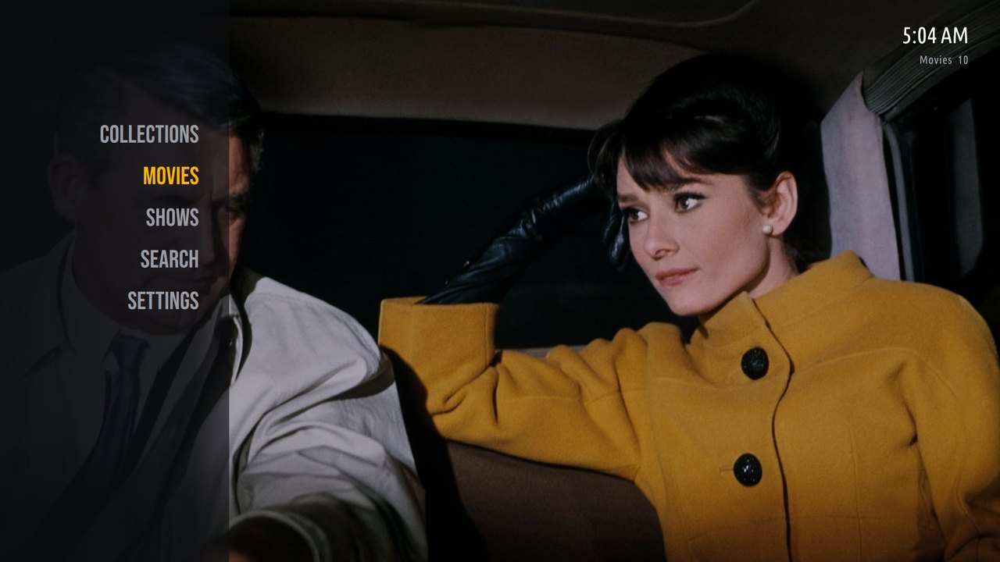
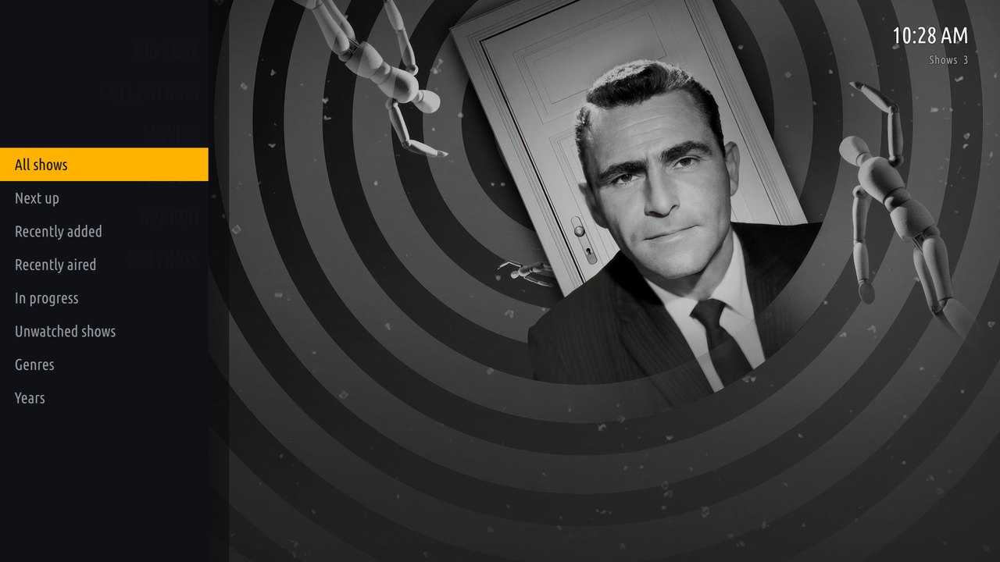
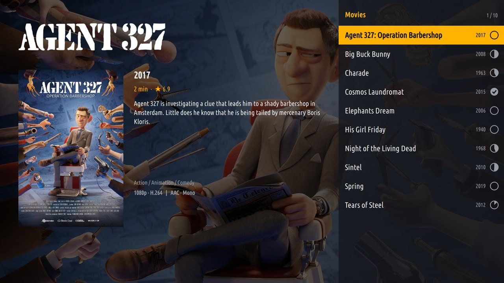
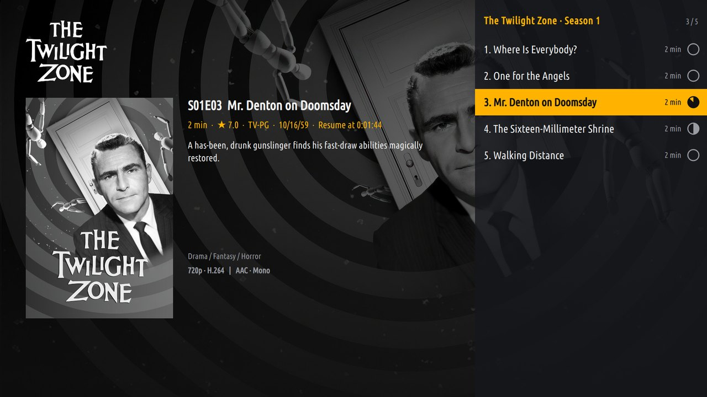
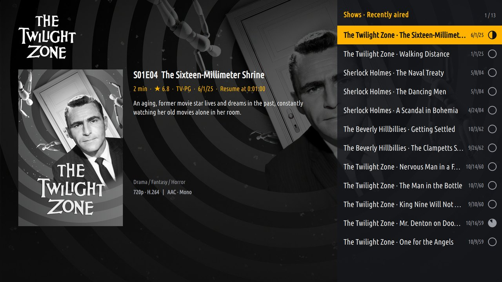
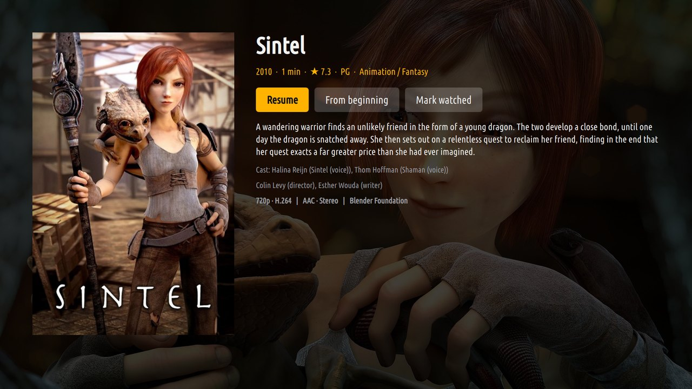
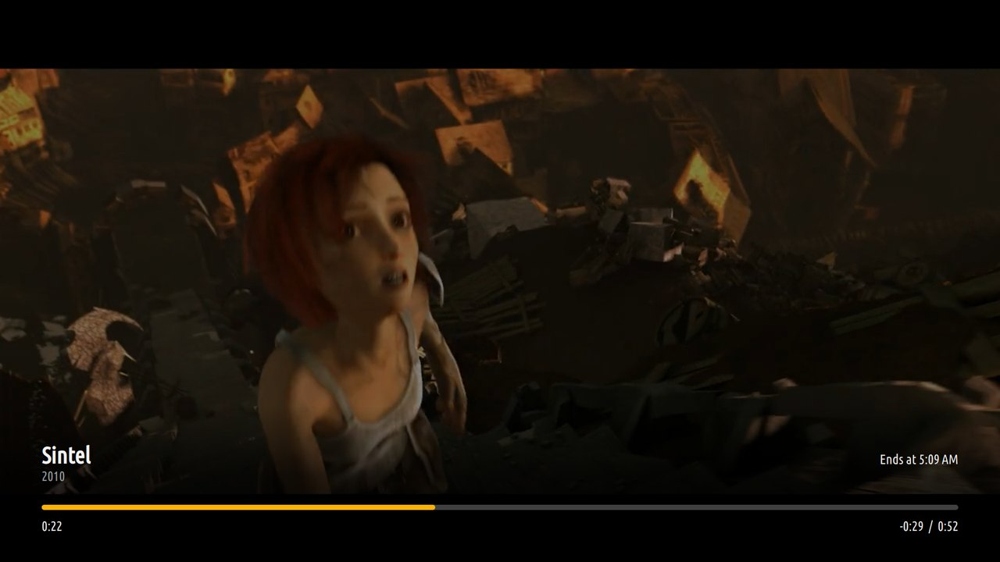

# Ember

A Jellyfin client for [couchbox](https://github.com/jpsutton/couchbox) that
browses like Kodi's Amber skin with its vertical menu: a text menu on the
left, list views with a details pane and fanart, and drill-down with Back,
all driven by a TV remote. Qt 6 (QML) and C++, with mpv for playback.

[PLAN.md](PLAN.md) has the design, the milestones and their status.



## Screenshots

<table>
  <tr>
    <td></td>
    <td></td>
  </tr>
  <tr>
    <td>Left on a library opens its submenu.</td>
    <td>The List view: details and fanart for the highlighted row.</td>
  </tr>
  <tr>
    <td></td>
    <td></td>
  </tr>
  <tr>
    <td>Episodes, with watched and in-progress marks.</td>
    <td>Recently aired: a show library's newest episodes, whichever show they belong to.</td>
  </tr>
  <tr>
    <td></td>
    <td></td>
  </tr>
  <tr>
    <td>Info shows an item's details, cast and actions.</td>
    <td>The player's panel. The video is the Sintel trailer (Blender Foundation, CC BY 3.0).</td>
  </tr>
</table>

Taken on a couchbox test box against a development server. The artwork is
whatever the server's metadata providers supplied.

## Using it

- **First start**: pick your server from the ones found on the network (or
  type its address), sign in with Quick Connect (or a user name and
  password), then choose which libraries the home menu shows.
- **Home**: Up/Down move through the menu, OK opens a library, Left or Back
  opens its submenu (recently added, recently aired, in progress, genres,
  years, collections and so on). Recently added and Recently aired list the
  library's films or episodes, newest first; an episode a streaming service
  released before its air date counts as aired when it was added.
- **Lists**: OK opens folders, shows and seasons, and plays movies and
  episodes (resuming where you left off). Info opens the item's details.
  Menu, or OK held for a moment, opens the context menu (play from the
  beginning, mark watched, go to the show). Left opens the view options
  (sort, order, hide watched, list style); Right, when sorted by name,
  opens the A–Z strip. Channel +/− page the list.
- **Playing**: OK or Play/Pause pauses, Left/Right seek, Up/Down and
  Channel +/− jump between chapters, Menu (or held OK) picks audio,
  subtitles and chapters, Info shows or hides the panel, Back or Stop ends
  playback. Near the end of an episode the next one is offered and starts by
  itself after a countdown.

Other Jellyfin clients see Ember as a device to play to: "Play On" from the
Jellyfin phone app starts playback on the TV, and its remote control pauses,
seeks, skips, moves around the menus and sends messages.

Settings (interface size, downmix and dialogue boost, streaming quality,
subtitles, next-episode behaviour, seek step) are on the home menu and are
saved in `~/.config/emberrc`. The session, which holds the access token, is
kept in `~/.local/state/ember/session`, readable only by its owner.

On couchbox, Ember also follows `~/.config/couchboxrc`: the `[Video]`
transcode settings decide which codecs the server is asked to convert, and
`PlezyScaling=fast` selects mpv's cheap scalers.

## Building

Needs Qt 6.8 or later (Base, Declarative, WebSockets), KDE Frameworks 6 (Config,
CoreAddons, DBusAddons, WindowSystem), QCoro 6, mpv (libmpv), Wayland
client libraries and wayland-protocols. On Arch:

```sh
pacman -S --needed cmake ninja extra-cmake-modules qt6-base qt6-declarative qt6-websockets \
  kconfig kcoreaddons kdbusaddons kwindowsystem qcoro mpv wayland wayland-protocols
cmake -S . -B build -G Ninja
cmake --build build
ctest --test-dir build
```

Video needs a Wayland session: mpv renders into a subsurface below Ember's
transparent window (see `src/player/plane/README.md`). `EMBER_WINDOWED=1`
opens a window instead of going full screen, and `EMBER_KEYS=1` logs every
key event.

## Development

- `scripts/dev-server.sh` runs a throwaway Jellyfin server in Docker with a
  generated library of short test clips named after open and public-domain
  films, so Jellyfin fetches real metadata and artwork. Admin user and
  password: `ember`.
- `-DEMBER_BUILD_DEV_TOOLS=ON` also builds `ember-plane-spike` (plays a file
  through the video plane) and `ember-shot` (screenshots through KWin,
  video included). `tools/remote-keys.py` presses keys through a virtual
  input device, as a remote would after fire-blaster.

## Licence

GPL-3.0-only (see [LICENSE](LICENSE)). The video plane is adapted from
[Plezy](https://github.com/edde746/plezy) (GPL-3.0) by way of
[couchbox-iptv](https://github.com/jpsutton/couchbox-iptv), and the Jellyfin
behaviour follows Plezy's Jellyfin backend.

The bundled fonts in `fonts/` are the ones Kodi's Amber skin uses: Ubuntu
Condensed (Ubuntu Font Licence 1.0, taken from Amber) and Bebas Neue (SIL
Open Font License 1.1, from Google Fonts). Their licences are next to them.
